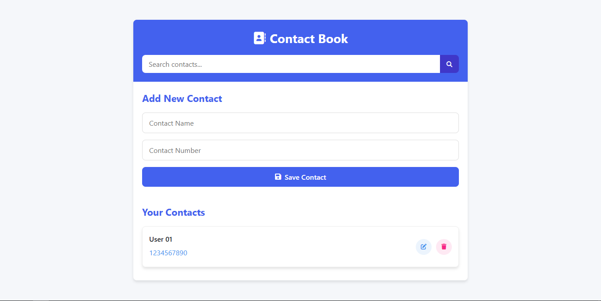

# Contact Book - Web Application

A simple yet functional Contact Book web application that allows users to store and manage their contacts efficiently.

## Live Demo

Check out the live demo here: [Contact Book Demo](https://thiyo-de.github.io/Contact-Book/)

## Features

- Add new contacts with name, phone number, and email
- View all saved contacts in a clean list
- Search contacts by name
- Responsive design that works on mobile and desktop

## Screenshot



## Technologies Used

- HTML5
- CSS3
- JavaScript (ES6)

## How to Use

1. Visit the [live demo](https://thiyo-de.github.io/Contact-Book/)
2. Click "Add Contact" to create new entries
3. Fill in the contact details in the form
4. Use the search bar to quickly find contacts

## Installation (Local Development)

If you want to run this project locally:

1. Clone the repository:
   ```bash
   git clone https://github.com/thiyo-de/Contact-Book.git
